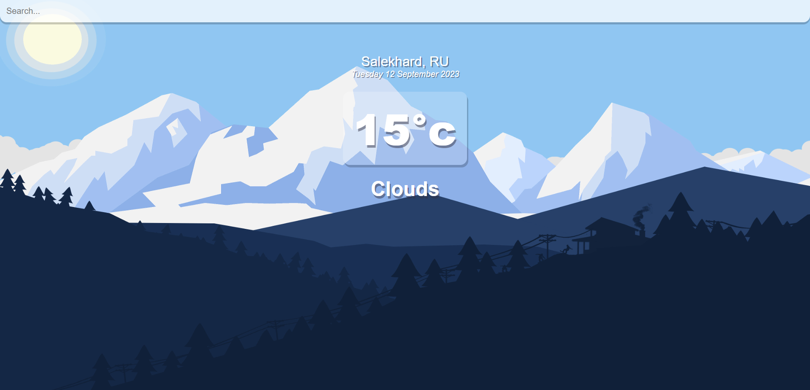
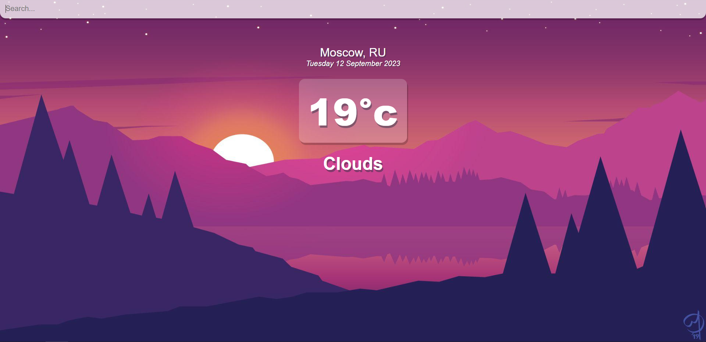

## How To Start

Recommended editor: `Visual Studio Code`

Required tools:

- Git
- Node.js
- Yarn

Download project:

```bash
git clone https://github.com/igor-vgs/weather-forecast-react.git
cd weather-forecast-react
```

Install dependencies:

```bash
yarn install
```
Start application:

```bash
yarn start
```
## Screenshots

<h3 align="center">Home</h3>

<p align="center">
  
</p>

<h3 align="center">Cold Weather Result</h3>

<p align="center">
  
</p>

<h3 align="center">Warm Weather Result</h3>

<p align="center">
  
</p>
